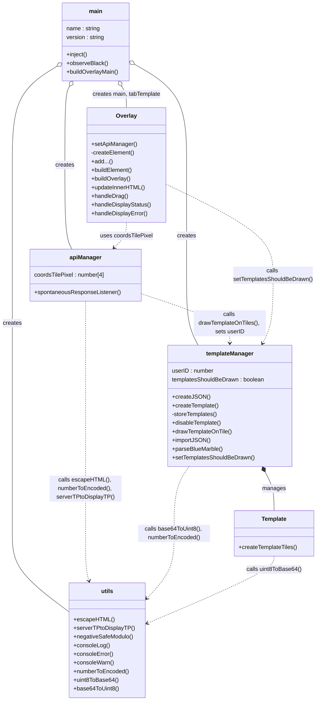
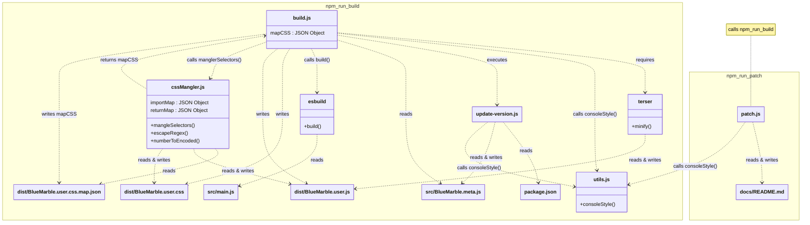

<table>
  <tr>
    <td><a href="#contributing">Contributing</a></td>
    <td valign="top" rowspan="99"></td>
  </tr>
  <tr>
    <td>&emsp;<a href="#summary">Summary</a></td>
  </tr>
  <tr>
    <td>&emsp;<a href="#why-follow-guidelines">Why Follow Guidelines?</a></td>
  </tr>
  <tr>
    <td>&emsp;<a href="#what-can-i-contribute">What Can I Contribute?</a></td>
  </tr>
  <tr>
    <td>&emsp;&emsp;<a href="#programming">Programming</a></td>
  </tr>
  <tr>
    <td>&emsp;&emsp;<a href="#translation">Translation</a></td>
  </tr>
  <tr>
    <td>&emsp;&emsp;<a href="#everything-else">Everything Else</a></td>
  </tr>
  <tr>
    <td>&emsp;<a href="#what-can-i-not-do">What Can I Not Do?</a></td>
  </tr>
  <tr>
    <td>&emsp;<a href="#guidelines">Guidelines</a></td>
  </tr>
  <tr>
    <td>&emsp;<a href="#our-mission">Our Mission</a></td>
  </tr>
  <tr>
    <td>&emsp;<a href="#how-to-contribute">How to Contribute</a></td>
  </tr>
  <tr>
    <td>&emsp;<a href="#production-enviroment">Production Enviroment</a></td>
  </tr>
  <tr>
    <td>&emsp;&emsp;<a href="#npm-run">Npm Run</a></td>
  </tr>
  <tr>
    <td>&emsp;&emsp;<a href="#charts">Charts</a></td>
  </tr>
  <tr>
    <td>&emsp;<a href="#development-environment">Development Environment</a></td>
  </tr>
</table>

<h1>Contributing</h1>

  Thank you for wanting to contribute to the userscript "Blue Marble"! It means a lot to me that someone likes my project enough to want to help it grow. If you haven't already done so, consider joining our Discord. You can ask questions about the userscript there and receive feedback.
   
  <b>Note</b>: If you are using AI, and you want to tell the AI how the codebase files are related to each-other, go to the <code>Class diagram of relationships for Blue Marble</code> diagram in the chart section of this file. Copy the chart, and give it to the AI.

<h2>Summary</h2>

  <ul>
    <li>I don't want to waste your time, so double check with me before starting a big change like adding a new feature. For example, imagine you spend 50 hours making a bot that automatically places pixels, then your pull request was rejected because a bot that automatically places pixles does not align with the "Mission" of Blue Marble. That would be sad :(</li>
    <li>Follow the style of the project. E.g., if all overlays are made by calling `Overlay()`, and you want to make a new overlay, you should probably call `Overlay()` as well.</li>
    <li>Low quality code will be rejected.</li>
    <li>You can find documentation for Blue Marble <a href="https://swingthevine.github.io/Wplace-BlueMarble/index.html" target="_blank" rel="noopener noreferrer">here</a>.</li>
  </ul>

<h2>Why Follow Guidelines?</h2>

  Following the guidelines on this page helps everyone. Writing code that follows the guidelines:
  <ul>
    <li>Helps me implement (and continue support for) your feature.</li>
    <li>You get your feature implemented.</li>
    <li>Everyone else gets a new supported feature.</li>
  </ul>
  It's a win-win-win scenario!

<h2>What Can I Contribute?</h2>
<h3>Programming</h3>
  

    Most of the work to be done in this userscript is related to programming. It is helpful to have a background in programming, but not required. If you are looking to learn JavaScript and its syntax, check out this <a href="https://roadmap.sh/javascript" target="_blank" rel="noopener noreferrer">roadmap for learning JavaScript</a>. We strongly recommend that you understand functions, methods, classes, and Object-Oriented-Programming if you plan to implement a brand new feature. More technical knowledge like method chaining and lambda expressions are useful but not required. You can find the documentation for Blue Marble <a href="https://swingthevine.github.io/Wplace-BlueMarble/index.html" target="_blank" rel="noopener noreferrer">here</a>.
  

<h3>Translation</h3>

  While typically overlooked, translating is a powerful way to contribute to a project. If you can write, there is something you can contribute! From minor grammar mistakes, to translating an entire language, all help is appreciated.

<h3>Everything Else</h3>
  

    Although userscripts are oriented around coding, there are many ways to contribute! From improving the README file, to making tutorials, you can contribute in many ways that don't require programming skills. For example, if you have an idea for a feature, but you don't have the skills to implement it, submit a feature request! Someone might see it, think it is cool, and implement it.
  

<h2>What Can I Not Do?</h2>

  Please do not use <a href="https://github.com/SwingTheVine/Wplace-BlueMarble/issues" target="_blank" rel="noopener noreferrer">GitHub Issues</a> for asking support questions (e.g. "How do I install this?" or "What does <code>cssMangler</code> do?"). We use the GitHub issue tracker for bug reports and feature requests. If you are having trouble and need help, ask on our <a href="https://discord.gg/tpeBPy46hf" target="_blank" rel="noopener noreferrer">Discord</a>. <b>However, you <i>should</i> make a feature request on our issue tracker before starting work on your contribution.</b> Nothing sucks more than working hard on a high-quality contribution just for it to be rejected because it does not align with the mission of the mod. Ask first!

  Please contribute in good faith. We will reject pull requests with bad code, comments, or pull requests that damage the mod. 

<h2>Guidelines</h2>
<ul>
  <li>Always submit a <a href="https://github.com/SwingTheVine/Wplace-BlueMarble/issues/new/choose" target="_blank" rel="noopener noreferrer">feature request</a> and receive authorization to work on your contribution <i>before</i> you start working on your contribution. This will save you time if we end up rejecting the contribution. Small contributions (like fixing spelling errors) don't need a feature request.</li>
  <li>Follow the <a href="https://github.com/SwingTheVine/.github/blob/main/CODE_OF_CONDUCT.md" target="_blank" rel="noopener noreferrer">Code of Conduct</a>. This includes both your contributions and the way you interact with this community.</li>
  <li>Always write a clear message that explains the changes. "Added some things" does <i>not</i> explain what was changed.</li>
  <li>Different feature, different pull request. If you submit a pull request for templates and localization (i18n) together, and we want to reject the localization, your template code is rejected along with the localization since they are the same pull request. They should be separate pull requests since they are separate features.</li>
  <li>The file structure must be maintained (unless you were authorized to change it). For example, all code should go in `src/` and all code affecting the overlay should go in the Overlay class file.</li>
  <li>The naming structure must be maintained (unless you were authorized to change it). For example, the template image variable could be called "templateDataImage." Most things are named to be grouped based on what they share in common first. In the previous example, the variable is first related to a "template," then "data" which is an "image." This is because the variable stores an image that comes from the data of a template. The main reason for naming things this way is to aid you when you try to find the name of something. "I need the image of a template, so the variable probably starts with 'template'".</li>
  <li>Your code must be commented, explaining what everything does. We may reject the pull request if we can't understand what the code does.</li>
</ul>

<h2>Our Mission</h2>

  Our "mission" makes up the essence of this userscipt. Without it, this project would not exist. 

  The mission of this userscript is to provide a well-documented, high-quality, open-source template overlay.

  <ul>
    <li>We recognize that most pixel canvas overlays do not have high-quality open-source code. Either the overlay is high-quality & close-sourced, or the overlay is low-quality & open-sourced. This userscript strives to fix that.</li>
    <li>We recognize that most pixel canvas overlay userscripts are obfuscated. While it is possible to modify them, it is unnecessarily challenging. This userscript hopes to change the precedence by being unobfuscated.</li>
    <li>We recognize that most pixel canvas overlay userscripts do not have enough documentation to allow their community to modify (or understand) the inner workings of the overlay. This userscript strives to be as beginner-friendly as possible.</li>
  </ul>

<h2>How To Contribute</h2>

  <ol>
    <li>Read all of the <a href="https://github.com/SwingTheVine/Wplace-BlueMarble/blob/main/docs/CONTRIBUTING.md" target="_blank" rel="noopener noreferrer">contributing guidelines</a>.</li>
    <li>If you would like to contribute, submit a request <a href="https://github.com/SwingTheVine/Wplace-BlueMarble/issues/new/choose" target="_blank" rel="noopener noreferrer">here</a>.</li>
    <li>If you have received authorization to start working on your contribution, set up the development environment on your device.</li>
    <li>Fork the project.</li>
    <li>Download your fork to the development environment.</li>
    <li>If applicable, it might be useful to learn how a (already in the userscript) feature similar to your contribution works. For example, if you want to add a new popup window, it might be benifical to learn how the <code>Overlay</code> popup window works.</li>
    <li>Make your contribution.</li>
    <li>Commit to your fork.</li>
    <li>Submit a pull request between your fork and this project.</li>
  </ol>

<h2>Production Enviroment</h2>

  Here lies information that may be of interest to those who wish to modify Blue Marble.

  <h3>Npm Run</h3>
  

    Running <code>npm run build</code> will compile Blue Marble. The compiled files can be found in the <code>dist/</code> directory. Running <code>npm run patch</code> will increment the patch version, and compile Blue Marble.
  

  <h3>Charts</h3>
  

    Use the arrow and zoom buttons to navigate the charts. Use the ↔️ button to go fullscreen. Use the 🔄 button to reset. All buttons can be found on the chart. Use the "two squares" icon to copy the chart. If you need assistance reading the chart, copy the chart into an AI using the "two squares" button on the chart.
  

<!-- https://mermaid.js.org/syntax/classDiagram.html -->

Class diagram of relationships for Blue Marble:
(last updated 0.74.0)

Class diagram of relationships for Blue Marble's compiler/builder:
(last updated 0.74.0)

<h2>Development Environment</h2>

  This is what SwingTheVine uses to program Blue Marble. You don't have to use the exact same thing. This is provided for reference.

  <h3>IDE</h3>
  Visual Studio Code 
  <code>Version: 1.102.3</code> 

  <h3>Browser</h3>
  Google Chrome 
  Version: <code>138.0.7204.184 (Official Build) (64-bit)</code> 
  TamperMonkey Version: <code>5.3.3</code>

  <h3>Operating System</h3>
  Windows 10 Home 
  Version: <code>22H2</code> 
  OS Build:	<code>19045.6093</code> 
  Processor: <code>Intel Core i7-9750H CPU @ 2.60GHz</code> 
  RAM: <code>16.0 GB</code> 
  Storage: <code>932 GB SSD Samsung SSD 970 EVO Plus 1TB, 238 GB SSD HFM256GDJTNG-8310A</code> 
  Graphics Card: <code>NVIDIA GeForce GTX 1660 Ti (6 GB)</code> 
  System Type: <code>64-bit operating system</code>

